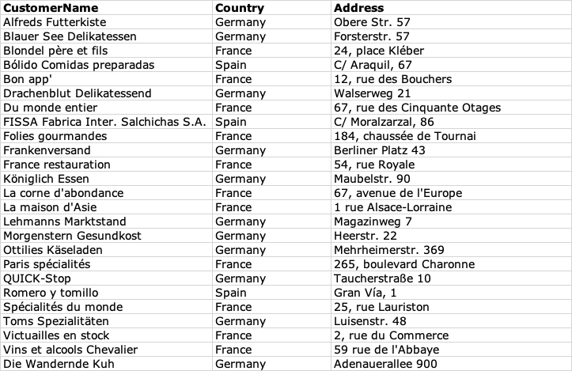
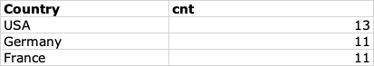
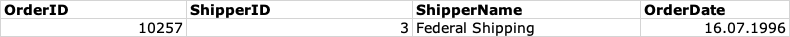
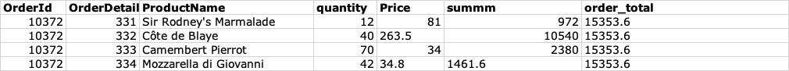
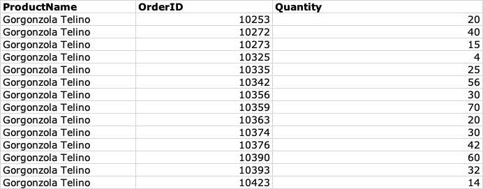
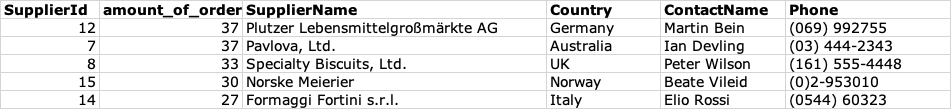
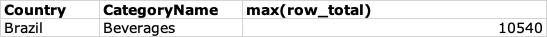
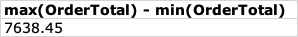
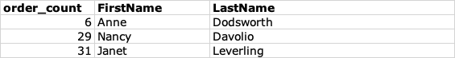
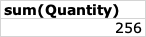

## Домашнее задание №1 sql

## 1. Выберите заказчиков из Германии, Франции и Мадрида, выведите их название, страну и адрес.

### запрос:
```sql
SELECT CustomerName, Country, Address  from customers where Country='France' or country='Germany' or city='Madrid';
```
### результат:


## 2. Выберите топ 3 страны по количеству заказчиков, выведите их названия и количество записей.

### запрос:

```sql
select Country, count(*) as cnt from Customers group by Country order by cnt desc limit 3;
```

### результат: 



##3. Выберите перевозчика, который отправил 10-й по времени заказ, выведите его название, и дату отправления.

### запрос:
```sql
select Orders.OrderId, Shippers.ShipperId, Shippers.ShipperName, Orders.OrderDate from Orders, Shippers 
where orders.ShipperId = shippers.ShipperId
order by Orders.orderdate asc limit 1 offset 9;
```
### результат:


##4. Выберите самый дорогой заказ, выведите список товаров с их ценами.

### запрос:
```sql
with checks as (

select OrderId, OrderDetailId, ProductName, quantity,  Price, sum(Products.Price * OrderDetails.Quantity) as summm from OrderDetails 
left join Products on OrderDetails.ProductId = Products.ProductId 
group by OrderId, OrderDetailId

)
, checks2 as (
select OrderId, sum(summM) as order_total from checks group by OrderId order by order_total desc
)
select *  from checks left join checks2 on checks.OrderId = checks2.OrderId 
where order_total = (select max(order_total) from checks2)
order by order_total desc;


```
### результат:


##5. Какой товар больше всего заказывали по количеству единиц товара, выведите его название и количество единиц в каждом из заказов.

### запрос:

```sql
with total_by_products as (
select ProductId, sum(Quantity) as total_product_quantity  from OrderDetails group by ProductId order by total_product_quantity desc
),
details_with_products as (
select * from OrderDetails left join Products on OrderDetails.ProductId = Products.ProductId 
)
select ProductName, OrderId, quantity from details_with_products left join total_by_products on total_by_products.ProductId = details_with_products.ProductId
where total_product_quantity = (select max(total_product_quantity) from total_by_products);

```

### результат:



## 6. Выведите топ 5 поставщиков по количеству заказов, выведите их названия, страну, контактное лицо и телефон.

### запрос: 

```sql
with order_supplier as (
select distinct OrderId, Products.SupplierId  from OrderDetails left join Products on 
OrderDetails.ProductId = Products.ProductId
left join Suppliers on
Products.SupplierId = Suppliers.SupplierId
),
totals as (
select SupplierId, count(*) amount_of_orders from order_supplier group by SupplierId order by amount_of_orders desc LIMIT 5
)
select totals.SupplierId, totals.amount_of_orders, SupplierName, Country, ContactName, Phone from totals left join Suppliers on totals.SupplierId = Suppliers.SupplierId; 

```

### результат:


## 7. Какую категорию товаров заказывали больше всего по стоимости в Бразилии, выведите страну, название категории и сумму.

### запрос: 
```sql
with bunch_of_joins as (
select Customers.Country, OrderDetails.OrderId, OrderDetails.Quantity, Products.Price,Categories.CategoryName, OrderDetails.Quantity * Products.Price as row_total, Products.CategoryId, OrderDetails.OrderDetailId from OrderDetails left join Orders on Orders.OrderId = OrderDetails.OrderId
left join Customers on Customers.CustomerId = Orders.CustomerId
left join Products on OrderDetails.ProductId = Products.ProductId
left join Categories on Categories.CategoryId = Products.CategoryId
where Country='Brazil'
order by row_total desc
)
select Country, CategoryName, max(row_total) from bunch_of_joins;
```
### ответ: 


## 8. Какая разница в стоимости между самым дорогим и самым дешевым заказом из США.
### запрос:
```sql
with bunch_of_joins as (
select Customers.Country, OrderDetails.OrderId, OrderDetails.Quantity, Products.Price, OrderDetails.Quantity * Products.Price as row_total,  OrderDetails.OrderDetailId from OrderDetails left join Orders on Orders.OrderId = OrderDetails.OrderId
left join Customers on Customers.CustomerId = Orders.CustomerId
left join Products on OrderDetails.ProductId = Products.ProductId
where Country='USA'
order by row_total desc
),
order_totals as (
select OrderId, sum(row_total) as OrderTotal from bunch_of_joins group by OrderId order by OrderTotal desc
)
select max(OrderTotal) - min(OrderTotal) from order_totals; 
```
### результат:


## 9. Выведите количество заказов у каждого их трех самых молодых сотрудников, а также имя и фамилию во второй колонке.

### запрос: 
```sql
with count_by_employyes as (
select EmployeeId, count(*) as order_count from orders group by employeeId
)
select order_count, FirstName, LastName from employees left join count_by_employyes on count_by_employyes.EmployeeId = Employees.EmployeeId order by BirthDate desc limit 3;
```
### результат: 


## 10. Сколько банок крабового мяса всего было заказано.
### запрос: 
```sql
select sum(Quantity) from OrderDetails where ProductId in (select ProductId from Products where ProductName like '%Crab Meat%');
```
### результат:
